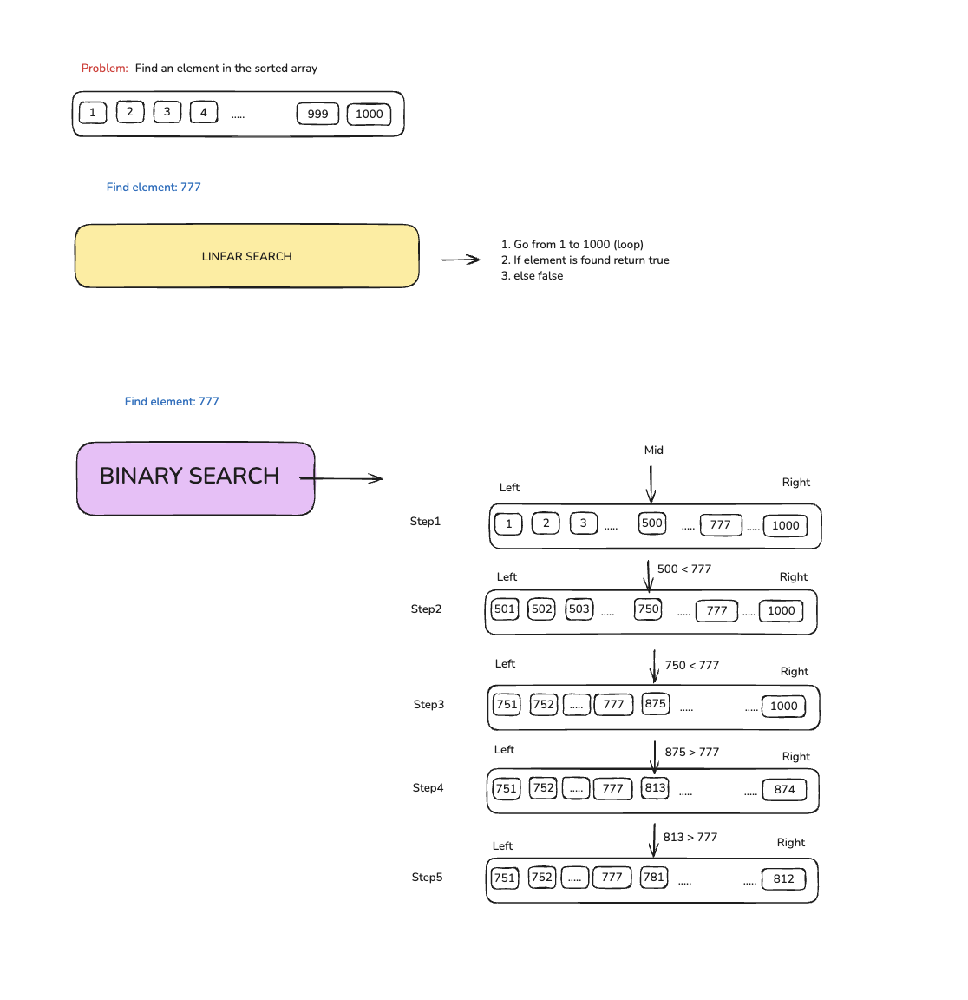
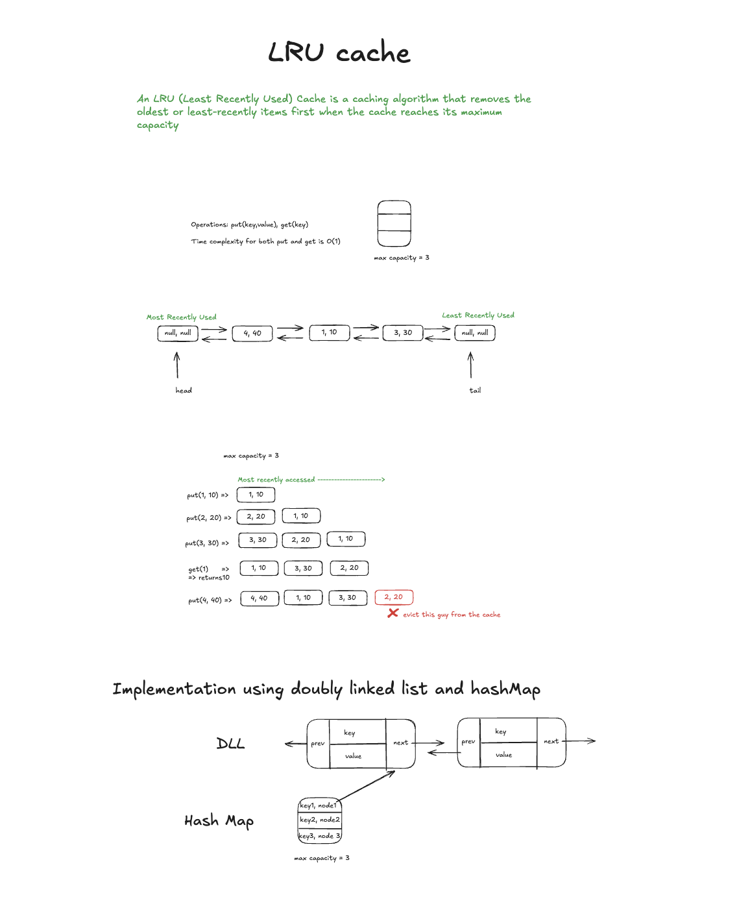

# aazh_aayvu_learning

Where learning goes deep

## Navigation

- [Setup](#setup)
- [Algorithms](#algorithms)
  - [Binary Search](#binary-search)
- [Data Structures](#data-structures)
  - [Queue](#queue)
  - [Stack](#stack)
  - [Singly Linked List](#singly-linked-list)
- [System Designs](#system-designs)
  - [LRU Cache](#lru-cache)

## Setup

Requires Node.js.

## Usage

Algorithms are organized under the `src/Algorithms/` folder.

Data structures are organized under the `src/DataStructures/` folder.

System design examples are organized under the `src/SystemDesign/` folder.

## Algorithms

### Binary Search

Binary Search example that compares a linear scan with binary search on a sorted array.

This implementation demonstrates:

- `linearSearch(arr, element)` with `O(N)` time complexity
- `binarySearch(arr, element)` with `O(log N)` time complexity on sorted input
- a simple example using `element = 11`

Binary search only works correctly when the input array is already sorted.

The current example uses:

```js
let arr = [1, 2, 3, 5, 6, 7, 9, 11, 13];
let element = 11;
```

Expected output:

```bash
true // Linear search output
true // Binary search output
```



To run the Binary Search example directly with Node.js, use:

```bash
node src/Algorithms/BinarySearch/index.js
```

## Data Structures

### Queue

Queue is implemented using a linked list.


To run the Queue implementation file directly with Node.js, use:

```bash
node src/DataStructures/Queue/index.js
```

### Stack

Stack implementation with performing operations like push, pop


To run the Stack implementation file directly with Node.js, use:

```bash
node src/DataStructures/Stack/index.js
```

### Singly Linked List

Singly Linked List with support for insertion at the beginning, insertion at a specific position, and deletion from the beginning.


To run the Singly Linked List implementation file directly with Node.js, use:

```bash
node src/DataStructures/SinglyLinkedList/index.js
```

## System Designs

### LRU Cache

LRU Cache implementation using a `Map` for O(1) lookups and a doubly linked list for O(1) insertion, deletion, and recency updates.

This implementation supports:

- `put(key, value)` to insert or update entries
- `get(key)` to fetch an entry and mark it as recently used
- automatic eviction of the least recently used item when capacity is reached



To run the LRU Cache implementation file directly with Node.js, use:

```bash
node src/SystemDesign/LRUCache/index.js
```
