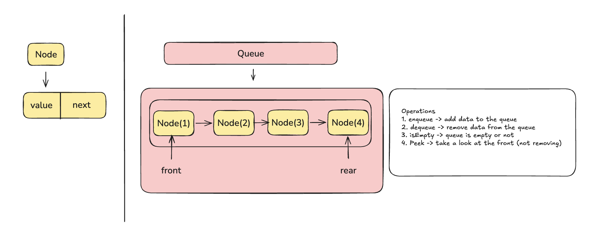
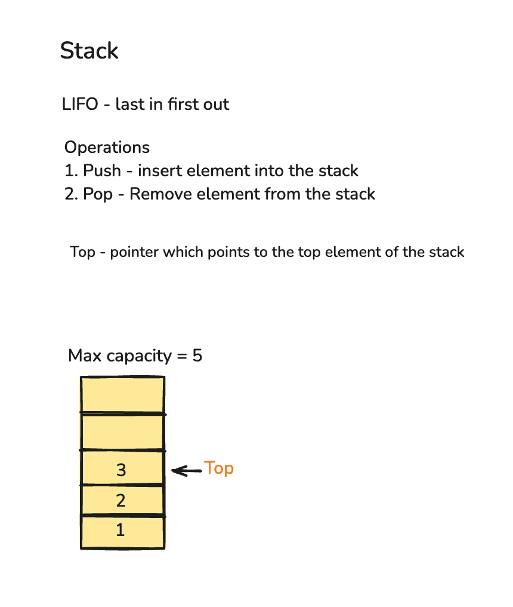
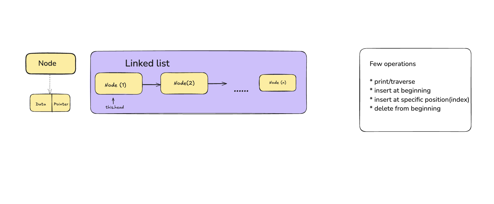

# aazh_aayvu_learning

Where learning goes deep

## Setup

Requires Node.js.

## Usage

Data structures are organized under the `src/DataStructures/` folder.

## Queue

Queue is implemented using a linked list.


To run the Queue implementation file directly with Node.js, use:

```bash
node src/DataStructures/Queue/index.js
```

## Stack

Stack implementation with performing operations like push, pop


To run the Stack implementation file directly with Node.js, use:

```bash
node src/DataStructures/Stack/index.js
```

## Singly Linked List

Singly Linked List with support for insertion at the beginning, insertion at a specific position, and deletion from the beginning.


To run the Singly Linked List implementation file directly with Node.js, use:

```bash
node src/DataStructures/SinglyLinkedList/index.js
```
